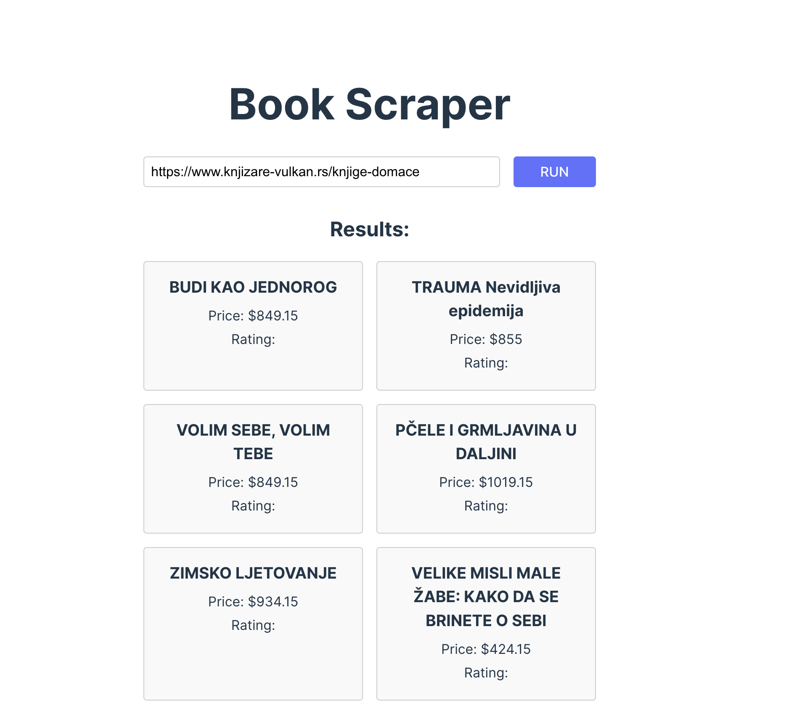

# LLM Books Scraper

A web scraper designed to collect book data for LLM training purposes.



## Overview

This project is a web scraping tool built to gather book-related data from various online sources. The collected data can be used for training Large Language Models (LLMs).

## Technologies Used

- **[AgentQL](https://www.agentql.com/)**

## Project Structure

```
llm-books-scraper/
├── src/
│   ├── App.tsx   // UI
│   ├── server.js // server code with the scraper
├── public/
├── .env          // environment variables
├── package.json  // project dependencies
└── README.md     // this file
```

## Getting Started

### Prerequisites

- Create a free account on [AgentQL](https://www.agentql.com/) and create a new API KEY
- Create .env file in the root of the project and add the AGENTQL_API_KEY to it:

```bash
AGENTQL_API_KEY=your_api_key_here
```

### Installation

1. Clone the repository:

```bash
git clone git@github.com:bozazec/llm-books-scraper.git
cd llm-books-scraper
```

2. Install dependencies:

```bash
npm install
```

### Usage

1. Run the local server:

```bash
npm run server
```

2. Run the scraper UI:

```bash
npm run dev
```

## Disclaimer

This project is for educational purposes only. The data collected is for training purposes and should not be used for any other purpose.

## Contributing

Contributions are welcome! Please feel free to submit a Pull Request.

## License

This project is licensed under the MIT License - see the [LICENSE](LICENSE) file for details.

### Uživajte u vrlom, novom svetu!
